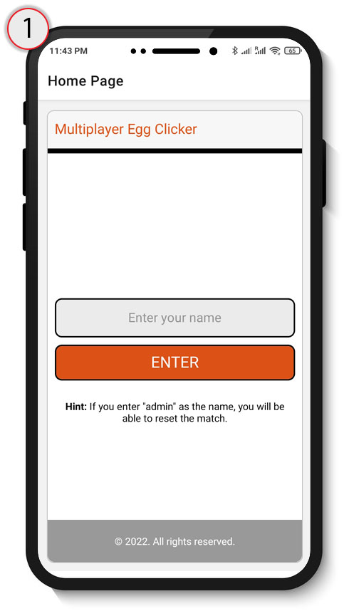
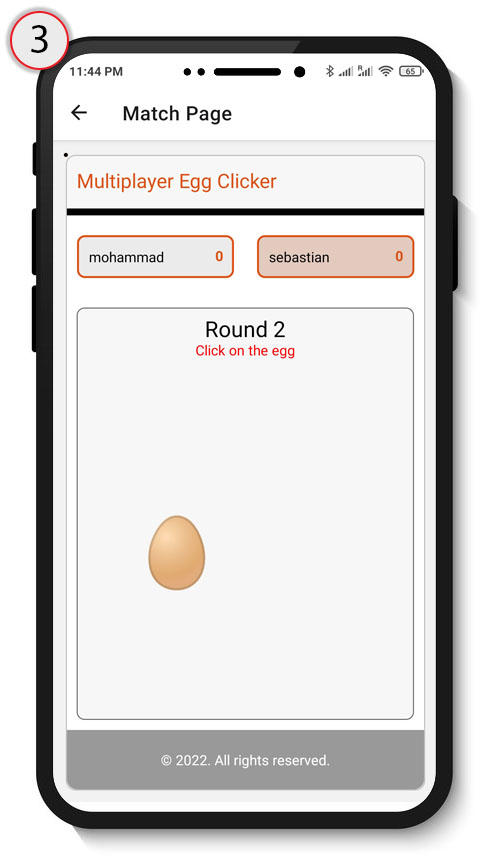
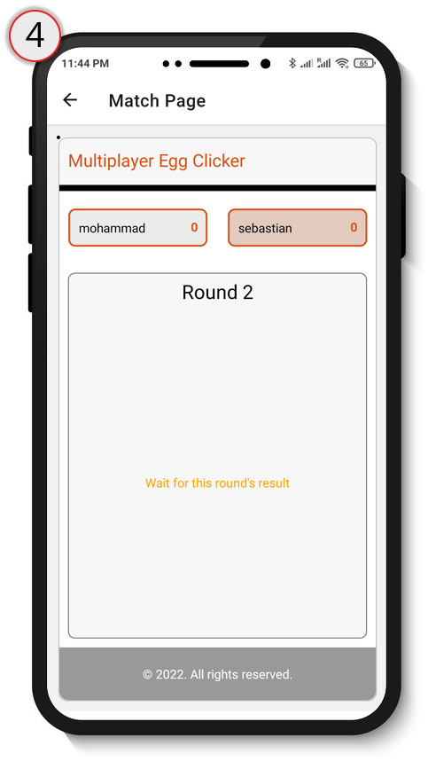
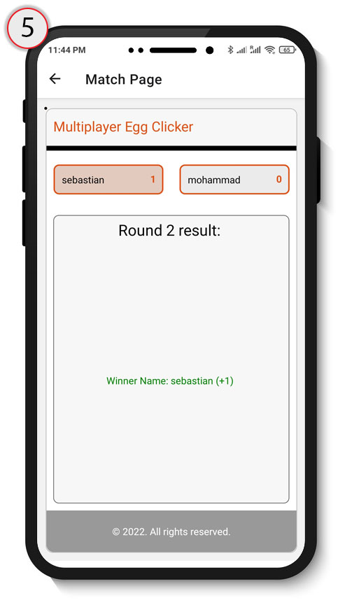
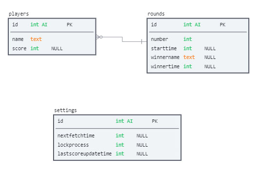

[](https://github.com)
[](https://github.com/ellerbrock/open-source-badges/)
<a href="https://reactnative.dev/"></a>
<a href="https://www.php.net/"></a>
<a href="https://www.mysql.com/"></a>
<a href="https://www.json.org/"></a>
<a href="https://www.android.com/intl/en_ca/"></a>
<a href="https://www.apple.com/ca/ios"></a>


# Multiplayer Egg Clicker Mobile App
<p align="justify">The Multiplayer Egg Clicker App is a competitive multiplayer mobile game. The basic idea is that there is a match and each match consists of several rounds. In addition, each player has an egg. If a player touches their egg faster than the other players, they will be the round winner in each round. A number will be added to their egg counter if someone wins the round. Finally, if a player reaches the number 10 for their egg counter, they will be the match-winner.</p>

<br>

<div align="center"></div>


## Table of content

- [Installation instructions](#installation-instructions)
- [Features list](#features-list)
- [Operating instructions (usage)](#operating-instructions-usage)
- [Technical descriptions](#technical-descriptions)
- [Manifest (list of files)](#manifest-list-of-files)
- [Building instructions](#building-instructions)
- [Configuration instructions](#configuration-instructions)
    - [Linking php files to the database (necessary)](#linking-php-files-to-the-database-necessary)
    - [Changing the hosting link (necessary)](#changing-the-hosting-link-necessary)
    - [Changing the app main color (optional)](#changing-the-app-main-color-optional)
    - [Changing match-winner score (optional)](#changing-match-winner-score-optional)
- [Bugs list and suggested ways to solve them](#bugs-list-and-suggested-ways-to-solve-them)
- [Todo list (future plans)](#todo-list-future-plans)
- [Copyright information and support](#copyright-information-and-support)
- [Contact information](#contact-information)
- [Credits and acknowledgments](#credits-and-acknowledgments)
- [Change log](#change-log)
- [License](#license)


## Installation instructions
- The app is available on android devices for now.
- You can download the apk file on your phone by clicking on the image below.
- After downloading the apk file, you can install the application by opening the apk file.
- Please note that you will need to enable installation from unknown sources in your android device settings section.

<a href="https://github.com/hasanpayandeh/MultiplayerEggClicker/releases/download/apk/multiplayereggclicker-cc5caf03cf254fed93cd32c18ea33dbc-signed.apk"></a>


## Features list

- Available on Android devices. Ability to create iOS and web applications with the existing React Native code
- Simplicity and ease of use
- Restarting a match using admin access
- Infinite number of players in a match

## Operating instructions (usage)

1.	Open the application on your mobile device
2.	Enter your name and touch the "ENTER" button
3.	Wait for an egg to appear
4.	Click on the egg as soon as you can
5.	Wait for the results
6.	See the results. The winner is who clicked faster on the egg.
7.	Repeat steps 3 to 6 for the next round
8.	If a player reaches number 10 for their score (the number of rounds that they were the round winner), they will be the winner of the match.


## Technical descriptions
The app is an online app that needs both **client-side** (developed by React Native) and **server-side** (developed by PHP and MySQL) development.<br>
- The **client-side** is our mobile app where the players interact with the game, and it consists of the following parts:<br>
    1.	Login page: It gets the players' names and redirects them to the match page.<br>
    2.	Match page: It shows the players' names, scores, a clickable egg, the result of each round, and the result of the match, and a scoreboard.<br>
- The **server-side** section stores different information about players, their scores, matches, and rounds. Also, it processes the client-side requests and provides appropriate answers. We implement this part in the server because all players should have shared and synchronized data. For instance, if a player won a round, other players should notice who the winner is, and they lost the round.


## Manifest (list of files)

```
- Back-end ............. Back-end folder containing server-side files and MySQL structure
- assets ............... assets folder containing images of the project
- App.js ............... A React Native file in which we developed our client-side codes 
- app.json ............. An automatically generated file by Expo CLI containing the app configurations
- babel.config.js ...... An automatically generated file by Expo CLI
- package.json ......... An automatically generated file by Expo CLI containing the project dependencies
- README.md ............ This readme file you are watching.
```


## Building instructions
There is two main part of building this app from scratch.<br>
- **Client-side:** You can access the codes related to the React Native app in the project files (App.js, app.json, and package.json). After downloading these files, you have to generate the android apk file (or iOS). For doing this you can use <a href="https://docs.expo.dev/workflow/expo-cli/">**Expo CLI**</a>. Also, there is an instruction (<a href="https://docs.expo.dev/classic/building-standalone-apps/">**click here**</a>) for making the app on the expo website that you have to follow for this purpose.

- **Server-side:** For this section, we used PHP and MySQL. Thus, you have to prepare a Linux hosting service. Then, you have two steps for making this section works:<br>
    1. Creating MySQL database: After creating your database, you can use the file we provided in the Back-end folder (mysql_structure.sql) and import it to your database. Also, you can create the database using this figure:
    <div align="center"></div>
        ii. Uploading PHP files: You have to upload the PHP files we provided in the Back-end folder(API.php and funtions.php) to your hosting and link them to your database. 


## Configuration instructions
### Linking php files to the database (necessary)
1. Open functions.php file.
2. Go to line 37 and change it based on your database information:
```cpp
$conn=dbconnect("localhost","YOUR_DATABASE_NAME","YOUR_DATABASE_USERNAME","YOUR_DATABASE_PASSWORD");
```
3. Upload funtions.php file to your hosting space

### Changing the hosting link (necessary)
1. Before generating your android apk file, open App.js file with a text editor.
2. Go to line 70 and change it based on your hosting information:
```cpp
fetch("YOUR_HOST_ADDRESS/API.php?action=login", {
```
3. Go to line 168 and change it based on your hosting information:
```cpp
fetch("YOUR_HOST_ADDRESS/API.php?action=retrievematchpage", {
```
4. Go to line 222 and change it based on your hosting information:
```cpp
fetch("YOUR_HOST_ADDRESS/API.php?action=resetmatch", {
```

### Changing the app main color (optional)
1. Open App.js file with a text editor.
2. Go to line 326 and change it **from**:
```cpp
const appMainColor = '#dc5116'; // If we change this const, the main color of the UI will change.
```
**to**:
```cpp
const appMainColor = 'THE_CODE_OF_THE_COLOR_YOU_WANT'; // If we change this const, the main color of the UI will change.
```

### Changing match-winner score (optional)
1. Open API.php file with a text editor.
2. Go to line 89 and change it **from**:
```cpp
elseif(sqlnum("players","where score>=10")!=0)
```
**to**:
```cpp
elseif(sqlnum("players","where score>=THE_NUMBER_YOU_WANT")!=0)
```


## Bugs list and suggested ways to solve them
1.	The time when an egg shows to the players of a match may be different for some players (synchronization problem). <br>
    **Suggested way to solve:** setting a specific date and time for showing the egg to all players in the server-side code and sending this date and time to the client-side and using it as the next request time
2.	When a player enters a match and clicks on the back button, they go to the login page but cannot log in with the same name again.<br>
    **Suggested way to solve:** using a password for each user to recognize them for the subsequent logins


## Todo list (future plans)
1.	Adding different rooms to have different matches at the same time
2.	Adding an admin section for managing the rooms and the users.
3.	Generating iOS application
4.	Generating web application with browser access


## Copyright information and support
This project is an open-source project and copyright free. So, you can do whatever you want with it!
Also, please feel free to contact me from the "Contact information" section if you need any help and clarification to expand this app.

Thank you!


## Contact information
The best way to contact me is my emails:<br>
**Academic email:** mpu236@uregina.ca<br>
**Personal email:** hasan.payandeh@gmail.com<br>


## Credits and acknowledgments
Here is a list of resources that we have used in this project (for the README.md file) and would like to give credit to:

- <a href="https://github.com/Naereen/badges">Naereen's Github repository of badges</a> - Using their badges
- <a href="https://github.com/alexandresanlim/Badges4-README.md-Profile">Alexandresanlim's Github repository of badges</a> - Using their badges
- <a href="https://github.com/matiassingers/awesome-readme">Matiassingers's awesome-readme repository</a> - Inspiring from their readme examples for building our README.md file


## Change log
### [1.0.1] - 2022-04-09
 
#### Added
   - assets/database-structure.jpg
   - assets/screenshots1.jpg
   - assets/screenshots2.jpg
   - assets/screenshots3.jpg
   - assets/screenshots4.jpg
   - assets/screenshots5.jpg
   - assets/download-apk.png
   
#### Changed
   - README.md
 
#### Fixed
    

## License
This project is an open-source project without any licenses.


